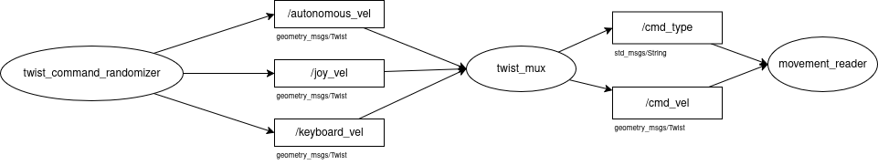

saya membuat file Node twist_mux.py yang berfungsi sebagai multiflexer

di node twist_mux terdapat parameter priorities sebagai prioritas topic yang bakal diteruskan ke node cmd_vel dan cmd_type 

alur kerjanya:

di node twist_mux juga terdapat parameter last_msgs yang menyimpan pesan terakhir dan timestamp nya...

cara kerjanya, setiap 0.5 sec akan menjalankan fungsi cmd_pub yang terdapat logic perulangan dari array priorities, logic ini akan memeriksa kalau pesan ada dan selisih waktu dengan pesan terakhir kurang dari timeout (0.5sec), maka akan mempublish msgs nya ke /cmd_vel dan type nya ke /cmd_type dan langsung break loopnya...

